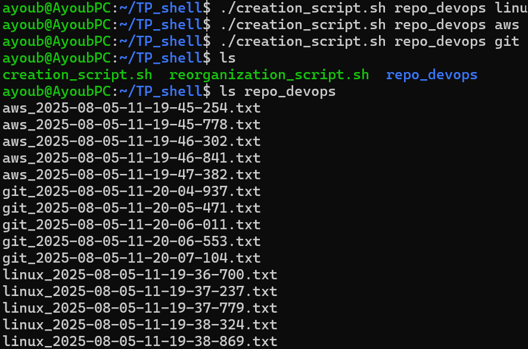
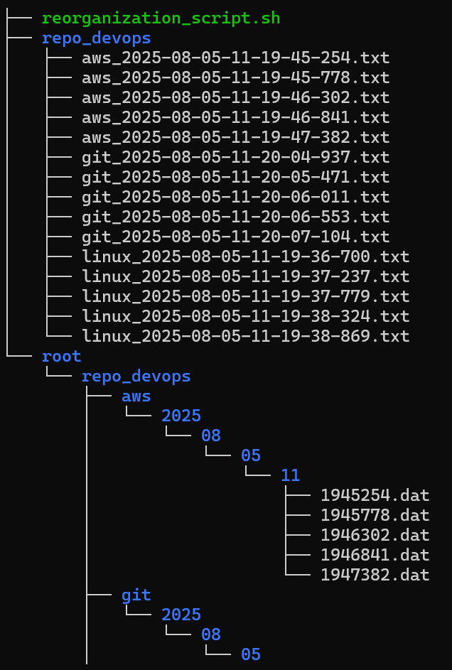

# TP Linux – Génération et Réorganisation de Fichiers Horodatés 🐧

Ce projet contient deux scripts Bash qui permettent de générer automatiquement des fichiers horodatés, puis de les organiser dans une structure de dossiers basée sur la date. Ce TP est conçu pour pratiquer la manipulation de fichiers et dossiers sous Linux via des scripts shell.

---

## Contenu du dépôt

- `creation_script.sh` : script de génération de fichiers horodatés.
- `reorganization_script.sh` : script de réorganisation de ces fichiers en dossiers triés par date.
- `root/` : dossier généré automatiquement par le second script, contenant les fichiers réorganisés.

---

Ce script crée un dossier spécifié en paramètre, puis génère 4 fichiers texte dont le nom contient un horodatage précis (année, mois, jour, heure, minute, seconde, milliseconde) et un préfixe également passé en paramètre.

### Usage

```bash
./creation_script.sh <nom_dossier> <préfixe>
```
**Exemple :**
./creation_script.sh repo_devops git

**Résultat attendu :**
```
repo_devops/
├── git_2025-08-06-14-30-21-123.txt
├── git_2025-08-06-14-30-21-623.txt
├── git_2025-08-06-14-30-22-123.txt
├── git_2025-08-06-14-30-22-623.txt
```
## 2. Script de réorganisation – `reorganization_script.sh`

Ce script prend en paramètre le nom du dossier créé par `creation_script.sh`. Il parcourt tous les fichiers `.txt` dans ce dossier, extrait les informations de date à partir du nom de chaque fichier, puis crée une structure de dossiers hiérarchique selon l’année, le mois, le jour et l’heure.

Chaque fichier est ensuite recréé dans ce nouvel emplacement sous la forme d’un fichier `.dat` dont le nom correspond à la minute, seconde et milliseconde. Ce fichier contient des informations sur son fichier source, son ancien emplacement, et indique quel script l’a créé.

### Usage

```bash
./reorganization_script.sh <nom_dossier>
```

**Exemple :**
./reorganization_script.sh repo_devops

**Résultat attendu :**
```
root/
└── repo_devos/
    └── git/
        └── 2025/
            └── 08/
                └── 06/
                    └── 14/
                        ├── 3021123.dat
                        ├── 3021623.dat
                        ├── 3022123.dat
                        └── 3023123.dat
```
Chaque fichier .dat contient par exemple :
Previous file name: 2025-08-06-14-30-21-123
Previous file location: logs/logfile_2025-08-06-14-30-21-123.txt
Name of the script that created this file: reorganization_script

## 3. Tester les scripts

### Résultat pour le premier script :



### Sortie de la commande `tree root` après exécution de `reorganization_script.sh` :




## 4. Conclusion et compétences abordées

Ce TP permet de se familiariser avec plusieurs concepts clés du scripting sous Linux :

- Utilisation des paramètres dans un script (`$1`, `$2`).
- Manipulation et formatage des dates avec la commande `date`.
- Création de fichiers et dossiers dynamiquement (`mkdir -p`, `touch`).
- Découpage et traitement de chaînes de caractères avec `IFS` et `read`.
- Parcours de fichiers dans un dossier avec des boucles `for`.
- Écriture dans des fichiers avec `echo` et redirections.
- Organisation et structuration automatique de fichiers selon des critères extraits du nom.

Ce projet peut être étendu ou adapté pour automatiser d’autres tâches de gestion de fichiers basées sur des métadonnées.

---

Merci et bon courage pour la suite ! 🚀


